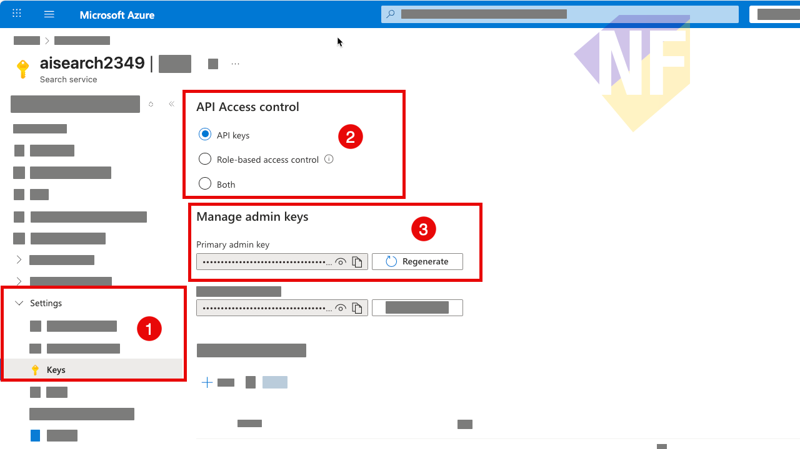

---
lab:
    title: 'Implement RAG with Azure AI Search and Semantic Kernel'
    description: 'Learn how to use Semantic Kernel to build a RAG application with Azure AI Search.'
---

# Implement RAG with Azure AI Search and Semantic Kernel

In this lab, you will learn how to implement Retrieval-Augmented Generation (RAG) using Azure AI Search and Semantic Kernel in a C# project. You will connect your Semantic Kernel application to an Azure AI Search index to retrieve relevant information and use it to ground the responses from the LLM.


## Prerequisites

Ensure you have the following Azure resources:
1.  **Azure OpenAI Service** or **Azure AI Foundry Project** (for Chat Completion and Text Embeddings).
2.  **Azure AI Search Service** (for storing and retrieving vector data).


## 1. Create an Azure AI Foundry hub and project

The features of Azure AI Foundry we're going to use in this exercise require a project that is based on an Azure AI Foundry *hub* resource.

1. In a web browser, open the [Azure AI Foundry portal](https://ai.azure.com) at `https://ai.azure.com` and sign in using your Azure credentials. Close any tips or quick start panes that are opened the first time you sign in, and if necessary use the **Azure AI Foundry** logo at the top left to navigate to the home page, which looks similar to the following image (close the **Help** pane if it's open):

    

1. In the browser, navigate to `https://ai.azure.com/managementCenter/allResources` and select **Create new**. Then choose the option to create a new **AI hub resource**.
1. In the **Create a project** wizard, enter a valid name for your project, and select the option to create a new hub. Then use the **Rename hub** link to specify a valid name for your new hub, expand **Advanced options**, and specify the following settings for your project:
    - **Subscription**: *Your Azure subscription*
    - **Resource group**: *Create or select a resource group*
    - **Region**:  East US 2 or Sweden Central (*In the event of a quota limit being exceeded later in the exercise, you may need to create another resource in a different region.*)

    > **Note**: If you're working in an Azure subscription in which policies are used to restrict allowable resource names, you may need to use the link at the bottom of the **Create a new project** dialog box to create the hub using the Azure portal.

    > **Tip**: If the **Create** button is still disabled, be sure to rename your hub to a unique alphanumeric value.

1. Wait for your project to be created, and then navigate to your project.

## 2. Deploy models

You need two models to implement your solution:

- An *embedding* model to vectorize text data for efficient indexing and processing.
- A model that can generate natural language responses to questions based on your data.

1. In the Azure AI Foundry portal, in your project, in the navigation pane on the left, Select the model catalog.

2. Deploy the **text-embedding-3-small** model using a **Global Standard** deployment with a Tokens Per Minute (TPM) rate limit of **500K** to ensure efficient indexing.

3. In the Azure AI Foundry portal, in your project, in the navigation pane on the left, under **My assets**, select the **Models + endpoints** page. Deploy a **gpt-4o** model using a **Global Standard** deployment of the most recent version with a TPM rate limit of **50K** (or the maximum available in your subscription if less than 50K).

    > **Note**: Reducing the Tokens Per Minute (TPM) helps avoid over-using the quota available in the subscription you are using. 50,000 TPM is sufficient for the data used in this exercise.

## 3. Add data to your project

The data for your app consists of a set of travel brochures in PDF format from the fictitious travel agency *Margie's Travel*. Let's add them to the project.

1. In a new browser tab, download the [zipped archive of brochures](https://github.com/MicrosoftLearning/mslearn-ai-studio/raw/main/data/brochures.zip) from `https://github.com/MicrosoftLearning/mslearn-ai-studio/raw/main/data/brochures.zip` and extract it to a folder named **brochures** on your local file system.
1. In Azure AI Foundry portal, in your project, in the navigation pane on the left, under **My assets**, select the **Data + indexes** page.
1. Select **+ New data**.
1. In the **Add your data** wizard, expand the drop-down menu to select **Upload files/folders**.
1. Select **Upload folder** and upload the **brochures** folder. Wait until all the files in the folder are listed.
1. Select **Next** and set the data name to `brochures`.
1. Wait for the folder to be uploaded and note that it contains several .pdf files.

## 4. Create an index for your data

Now that you've added a data source to your project, you can use it to create an index in your Azure AI Search resource.

1. In Azure AI Foundry portal, in your project, in the navigation pane on the left, under **My assets**, select the **Data + indexes** page.
1. In the **Indexes** tab, add a new index with the following settings:
    - **Source location**:
        - **Data source**: Data in Azure AI Foundry
            - *Select the **brochures** data source*
    - **Index configuration**:
        - **Select Azure AI Search service**: *Create a new Azure AI Search resource with the following settings*:
            - **Subscription**: *You Azure subscription*
            - **Resource group**: *The same resource group as your AI hub*
            - **Service name**: *A valid name for your AI Search Resource*
            - **Location**: *The same location as your AI hub*
            - **Pricing tier**: Basic
            
            Wait for the AI Search resource to be created. Then return to the Azure AI Foundry and finish configuring the index by selecting **Connect other Azure AI Search resource** and adding a connection to the AI Search resource you just created.
 
        - **Vector index**: `hotels-index`
        - **Virtual machine**: Auto select
    - **Search settings**:
        - **Vector settings**: Add vector search to this search resource
        - **Azure OpenAI connection**: *Select the default Azure OpenAI resource for your hub.*
        - **Embedding model**: text-embedding-3-small
        - **Embedding model deployment**: *This will create new deployment for text-embedding-3-small*

1. Create the vector index and wait for the indexing process to be completed, which can take a while depending on available compute resources in your subscription.

    The index creation operation consists of the following jobs:

    - Crack, chunk, and embed the text tokens in your brochures data.
    - Create the Azure AI Search index.
    - Register the index asset.

    > **Tip**: While you're waiting for the index to be created, why not take a look at the brochures you downloaded to get familiar with their contents?

## 5. Test the index in the playground

Before using your index in a RAG-based prompt flow, let's verify that it can be used to affect generative AI responses.

1. In the navigation pane on the left, select the **Playgrounds** page and open the **Chat** playground.
1. On the Chat playground page, in the Setup pane, ensure that your **gpt-4o** model deployment is selected. Then, in the main chat session panel, submit the prompt `Where can I stay in New York?`
1. Review the response, which should be a generic answer from the model without any data from the index.
1. In the Setup pane, expand the **Add your data** field, and then add the **hotels-index** project index and select the **hybrid (vector + keyword)** search type.

   > **Tip**: In some cases, newly created indexes may not be available right away. Refreshing the browser usually helps, but if you're still experiencing the issue where it can't find the index you may need to wait until the index is recognized.

1. After the index has been added and the chat session has restarted, resubmit the prompt `Where can I stay in New York?`
1. Review the response, which should be based on data in the index.

## 6. Prepare the application configuration

1. Open a new browser tab and browse to the [Azure portal](https://portal.azure.com).
2. Get Azure AI Search endpoint and key
    
    1. In the Azure portal, navigate to the resource group that contains your Azure AI Search service and select the search service.
    2. On the Overview page, copy the URL (this is your endpoint value for AZURE_SEARCH_ENDPOINT).
   
    3. In the left menu, select Keys to view admin keys. Copy one of the admin keys (use this for AZURE_SEARCH_KEY). Do not use a query key for write/index operations.
   
    4. Copy these values for AZURE_SEARCH_ENDPOINT and AZURE_SEARCH_KEY (endpoint should include https://) in the appsettings.json

3. Open the `appsettings.json` file:
    ```powershell
    code appsettings.json
    ```
4. Update the following keys with your Azure resource details:
    - `AZURE_OPENAI_KEY`
    - `AZURE_OPENAI_ENDPOINT`
    - `DEPLOYMENT_NAME` (Your chat completion deployment, e.g., gpt-4o)
    - `EMBEDDING_DEPLOYMENT_NAME` (Your embedding deployment, e.g., text-embedding-3-large)
    - `AZURE_SEARCH_ENDPOINT`
    - `AZURE_SEARCH_KEY`

   

6. Save and close the file.

## Create the Search Plugin

1. Open the `Program.cs` file in the `C-sharp` folder: 
    ```powershell
    code Program.cs
    ```
2. In the file, Find `#region Index Schema`, then insert the Index Schema definition below it. This will define the structure of the documents stored in the Azure AI Search index. (You can check the AI Search returned fields in the Azure portal if needed.):

    ```csharp
    #region Index Schema

    /// <summary>
    /// Custom index schema. It may contain any fields that exist in search index.
    /// </summary>
    sealed class IndexSchema
    {
        [JsonPropertyName("id")]
        public string ChunkId { get; set; }

        [JsonPropertyName("content")]
        public string Chunk { get; set; }

        [JsonPropertyName("title")]
        public string Title { get; set; }

        [JsonPropertyName("contentVector")]
        public ReadOnlyMemory<float> Vector { get; set; }
    }

    #endregion
    ```

3. Next, find `#region Azure AI Search Service` and insert the following code to implement the Azure AI Search service that will handle vector search queries:

    ```csharp
    #region Azure AI Search Service

    /// <summary>
    /// Abstraction for Azure AI Search service.
    /// </summary>
    interface IAzureAISearchService
    {
        Task<string?> SearchAsync(
            string collectionName,
            ReadOnlyMemory<float> vector,
            List<string>? searchFields = null,
            CancellationToken cancellationToken = default);
    }

    /// <summary>
    /// Implementation of Azure AI Search service.
    /// </summary>
    sealed class AzureAISearchService(SearchIndexClient indexClient) : IAzureAISearchService
    {
        private readonly List<string> _defaultVectorFields = ["contentVector"];

        private readonly SearchIndexClient _indexClient = indexClient;

        public async Task<string?> SearchAsync(
            string collectionName,
            ReadOnlyMemory<float> vector,
            List<string>? searchFields = null,
            CancellationToken cancellationToken = default)
        {
            // Get client for search operations
            SearchClient searchClient = this._indexClient.GetSearchClient(collectionName);

            // Use search fields passed from Plugin or default fields configured in this class.
            List<string> fields = searchFields is { Count: > 0 } ? searchFields : this._defaultVectorFields;

            // Configure request parameters
            VectorizedQuery vectorQuery = new(vector);
            fields.ForEach(vectorQuery.Fields.Add);

            SearchOptions searchOptions = new() { VectorSearch = new() { Queries = { vectorQuery } } };

            // Perform search request
            Response<SearchResults<IndexSchema>> response = await searchClient.SearchAsync<IndexSchema>(searchOptions, cancellationToken);

            List<IndexSchema> results = [];

            // Collect search results
            await foreach (SearchResult<IndexSchema> result in response.Value.GetResultsAsync())
            {
                results.Add(result.Document);
            }

            // Return text from first result.
            // In real applications, the logic can check document score, sort and return top N results
            // or aggregate all results in one text.
            // The logic and decision which text data to return should be based on business scenario. 
            return results.FirstOrDefault()?.Chunk;
        }
    }

    #endregion
    ```

4. Next, find `#region Azure AI Search Plugin` and insert the following code to implement the Azure AI Search plugin that will expose the search functionality to the Semantic Kernel:

    ```csharp
    #region Azure AI Search SK Plugin

    /// <summary>
    /// Azure AI Search SK Plugin.
    /// It uses <see cref="ITextEmbeddingGenerationService"/> to convert string query to vector.
    /// It uses <see cref="IAzureAISearchService"/> to perform a request to Azure AI Search.
    /// </summary>
    sealed class MyAzureAISearchPlugin(
        IEmbeddingGenerator<string, Embedding<float>> embeddingGenerator,
        IAzureAISearchService searchService)
    {
        private readonly IEmbeddingGenerator<string, Embedding<float>> _embeddingGenerator = embeddingGenerator;
        private readonly IAzureAISearchService _searchService = searchService;

        [KernelFunction("Search")]
        public async Task<string> SearchAsync(
            string query,
            string collection,
            List<string>? searchFields = null,
            CancellationToken cancellationToken = default)
        {
            // Convert string query to vector
            ReadOnlyMemory<float> embedding = (await this._embeddingGenerator.GenerateAsync(query, cancellationToken: cancellationToken)).Vector;

            // Perform search
            return await this._searchService.SearchAsync(collection, embedding, searchFields, cancellationToken) ?? string.Empty;
        }
    }

    #endregion
    ```

## Explore how the kernel leverages Azure AI Search

1. Open `Program.cs`: 
    ```powershell
    code Program.cs
    ```

2. Find the comment section `// 1. Create the Kernel Builder` and add the following code to create the new Semantic Kernel builder:

    ```csharp
    // 1. Create the Kernel Builder
    var builder = Kernel.CreateBuilder();
    ```
3. Below that, find the comment section `// 2. Add Azure OpenAI Chat Completion` and add the following code to register the Azure OpenAI chat completion and embedding generator services:

    ```csharp
    // 2. Add Azure OpenAI Chat Completion
    builder.AddAzureOpenAIChatCompletion(
            deploymentName: config["DEPLOYMENT_NAME"]!,
            endpoint: config["AZURE_OPENAI_ENDPOINT"]!,
            apiKey: config["AZURE_OPENAI_KEY"]!
        );

    ```
4. Below that, find the comment section `// 3. SearchIndexClient from Azure .NET SDK to perform search operations.` and add the following code to register the Azure AI Search client and service:

    ```csharp
    // 3. SearchIndexClient from Azure .NET SDK to perform search operations.
    builder.Services.AddSingleton<SearchIndexClient>((_) => new SearchIndexClient(
        new Uri(config["AZURE_SEARCH_ENDPOINT"]!), 
        new AzureKeyCredential(config["AZURE_SEARCH_KEY"]!)
    ));
    ```

5. Below that, find the comment section `// 4. Custom AzureAISearchService to configure request parameters and make a request.` and add the following code to register the custom Azure AI Search service:

    ```csharp
    // 4. Custom AzureAISearchService to configure request parameters and make a request.
    builder.Services.AddSingleton<IAzureAISearchService, AzureAISearchService>();
    ```
6. Below that, find the comment section `// 5. Embedding generation service to convert string query to vector` and add the following code to register the Azure AI Search plugin with the kernel:

    ```csharp
    // 5. Embedding generation service to convert string query to vector
    builder.AddAzureOpenAIEmbeddingGenerator(
        deploymentName: config["EMBEDDING_DEPLOYMENT_NAME"]!, 
        endpoint: config["AZURE_OPENAI_ENDPOINT"]!, 
        apiKey: config["AZURE_OPENAI_KEY"]!
    );
    ``` 
7. Below that, find the comment section `// 6. Register Azure AI Search Plugin` and add the following code to register the Azure AI Search plugin with the kernel:

    ```csharp
    // 6. Register Azure AI Search Plugin
    builder.Plugins.AddFromType<MyAzureAISearchPlugin>();
    ```

8. Below that, find the comment section `// 7. Create kernel` and add the following code to build the kernel:

    ```csharp
    // 7. Create kernel
    var kernel = builder.Build();
    ```

9. Finally, find the code that constructs the prompt string and add the following code to query the index by name:

    ```csharp
    // 8. Invoke the prompt
    Console.Write("User: ");
    string query = Console.ReadLine()!;

    // Query with index name
    // The final prompt will look like this "Hotel... is ?".
    var result = await kernel.InvokePromptAsync(
    $"{{{{search '{query}' collection='{config["INDEX_NAME"]}'}}}} {query}");

    Console.WriteLine($"Assistant: {result}");
    ```

## Run the application

1. Build and run the project:
    ```powershell
    dotnet run
    ```
2. When prompted, ask a question that can be answered from the brochures index, for example:
    ```text
    Tell me where to stay in New York?
    ```
3. Observe how the assistant first pulls the relevant brochure content via the vector search plugin before answering.

## Extend the pattern to other vector solutions

- **Swap the search backend**: implement `IAzureAISearchService` against any vector-capable store (Pinecone, Qdrant, Weaviate, etc.) while keeping the plugin and prompt the same.
- **Reuse Semantic Kernel components**: the embedding generator and `MyAzureAISearchPlugin` sit between the LLM and the search service, so they remain unchanged when the vector store changes.
- **Understand the data flow**: the plugin turns text into vectors, the search service retrieves matching documents, and the prompt adds the retrieved context before invoking the chat completion. This clear separation is what lets you explore other vector solutions next.
